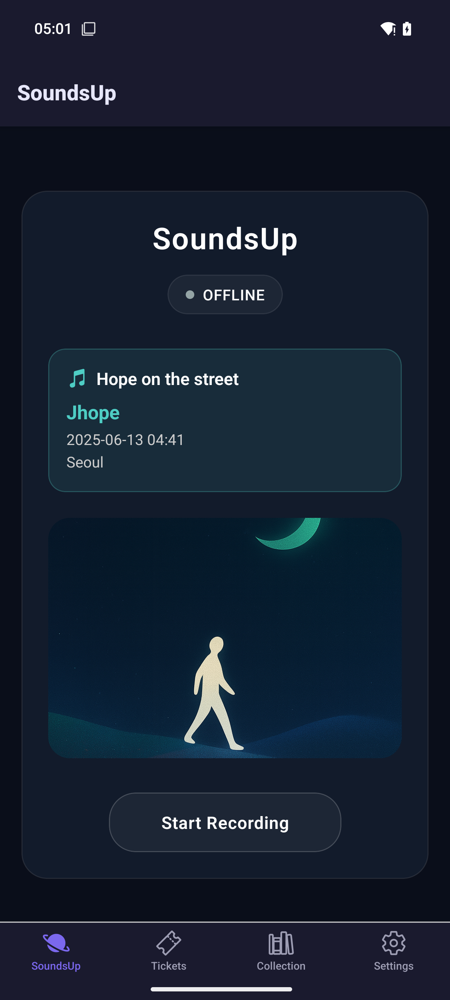
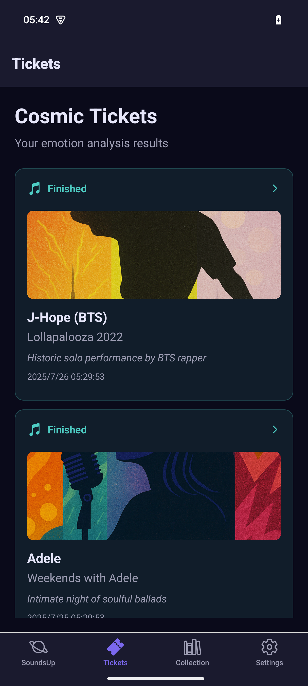
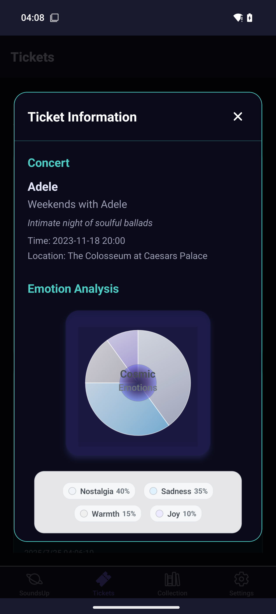
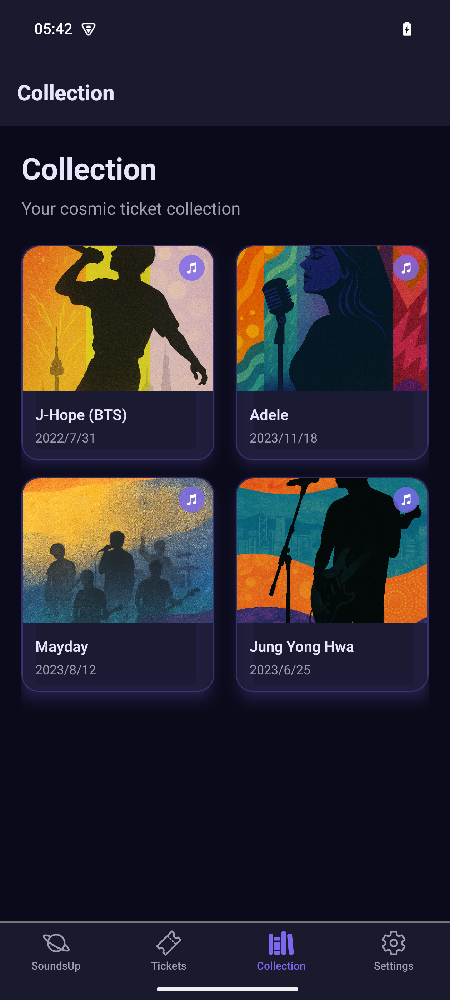

# SoundsUp-
让每一次现场表演的律动，都能再次触动心灵的跳动。#AdventureX2025

## 产品设想
一款结合AI与便携硬件的全新记忆体验产品。它通过手机上的app（理想中会是一个纽扣大小的AI硬件设备，适配磁吸、徽章等多种硬件形态），自动捕捉用户在演唱会、音乐会、Livehouse等声音娱乐场景下的现场声音、节奏与氛围。AI会自动分析这段专属音频，捕捉各分段的情感表达类型及Highlight片段，最终为用户生成融合演出信息、音频与情绪数据的数字票根，让每一次现场声音的律动，都能在新时空下重新触动心灵的跳动。

## 产品故事
一位孤独的旅者，走在安静的沙丘之上，直到夜空中响起一段旋律，那是他记忆中最闪耀的一段声音。从此，每一次声音，都能记录一个“声动时刻”。

## 产品功能
- 自动捕捉现场声音、节奏与氛围
- 自动分析情感表达类型及Highlight片段
- 生成融合演出信息、音频与情绪数据的数字票根
- 提供情感分析报告，帮助用户更好地理解自己的情感表达

## Version 1 Demo

|主页作为录音入口|票根列表页|
|-----------------------------|-------------------------------|
|||
|情绪分析页|票根收藏页|
|-----------------------------|-----------------------------|
|||

### 电子票根生成范例

Btw：这个票根其实是基于情绪分析得到的！你能看到上面有很多的元素，希望一看到这个票根能让你想起那一天的演唱会，也能记起专属于Adele的声音~
